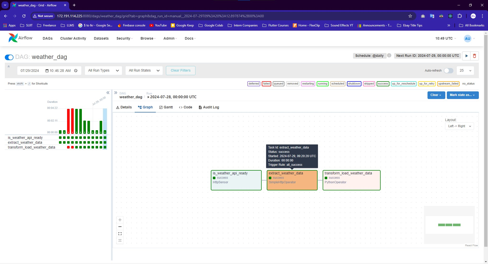

# Azure Weather Data Pipeline: Automated ETL with Airflow

This project showcases the development and automation of a Python ETL (Extract, Transform, Load) pipeline utilizing Apache Airflow, deployed on an Azure Virtual Machine. The primary objective of this pipeline is to seamlessly manage weather data extraction, transformation, and loading processes, ensuring data is readily available for further analysis or application use.

## Key Components and Functionalities
1. **Data Extraction**
The pipeline initiates by extracting real-time weather data from the Open Weather Map API. This involves setting up HTTP sensors and operators within Apache Airflow to periodically query the API and retrieve weather data in JSON format.

2. **Data Transformation**
Post extraction, the raw weather data undergoes a series of transformations using Python. This transformation stage involves cleaning, normalizing, and structuring the data to meet specific requirements. The transformations ensure that the data is in a consistent format, making it suitable for storage and future analysis.

3. **Data Loading**
The transformed weather data is then loaded into Azure Blob Storage. This storage solution offers scalability and security, ensuring that the weather data is stored efficiently and can be accessed or processed as needed. The integration with Azure Blob Storage is handled using the Azure Storage Blob library in Python.

4. **Automation with Apache Airflow**
Apache Airflow orchestrates the entire ETL process, automating the data pipeline to run at scheduled intervals. Airflow's DAG (Directed Acyclic Graph) structure allows for defining the sequence of tasks, ensuring reliable and repeatable data workflows. Airflow’s capabilities enable monitoring, logging, and alerting, providing a robust environment for managing ETL processes.

5. **Deployment on Azure Virtual Machine**
The project is deployed on an Azure Virtual Machine, leveraging Azure's cloud infrastructure to ensure high availability and performance. The virtual machine setup includes configuring necessary software dependencies and ensuring that the Airflow environment is optimized for handling ETL tasks.

By combining Apache Airflow, Python, and Azure services, this project exemplifies how to build a scalable, automated, and efficient ETL pipeline. The solution is designed to be extensible, allowing for easy adaptation to other data sources or storage solutions, making it a versatile framework for various data engineering needs. **Azure Blob Storage**: Destination for the transformed data.

## Setup

### Prerequisites
- Azure account with a Virtual Machine and Blob Storage set up.
- Python 3.x installed on your VM.
- Apache Airflow installed on your VM.

### Installation
1. **Clone the repository**:
  ```sh
  git clone https://github.com/mayurasandakalum/azure-airflow-weather-etl.git
  ```
2. **Navigate to the project directory**:
  ```sh
  cd your-repo-name
  ```
3. **Install the required Python packages**:
  ```sh
  pip install -r requirements.txt
  ```

## Usage


### Azure Setup
- **Azure VM Setup**
  

- **Azure Blob Storage**
  

### Code Samples
- **ETL Pipeline Code**
  
  


### Connecting to Azure VM
1. **SSH into your Azure VM**:
   

### Starting Airflow
  - **Access the Airflow web UI** at `http://<vm-public-ip>:8080` and trigger the DAG.
   
  - **DAG Overview**
   

### Task Details
- **Task: Check Weather API is Ready**
  
  
- **Task: Extract Weather Data**
  
  
- **Task: Transform and Load Data**
  
  
